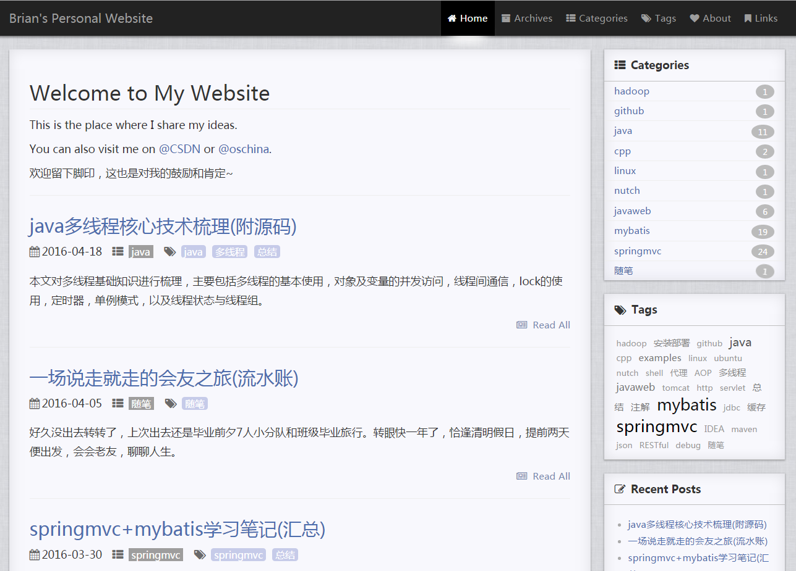

# Soonwait's Personal Website

---

## Introduction

This is my personal website based on jekyll.**Please give a star at this repository if you think it's nice.** Then you can clone it as your blog model.

You can see the Site by clicking [here](http://soonwait.github.io/) 

Runing on Github + Jekyll theme by [Soonwait](https://github.com/soonwait/soonwait.github.io)

这是我的个人网站，基于jekyll。**如果觉得不错，请先在这个仓库上点个star吧**，这也是对我的肯定和鼓励，谢谢了。

我的个人网站地址: [Soonwait's Personal Website](http://soonwait.github.io/)

该网站使用的是[高浩阳](https://github.com/Gaohaoyang/gaohaoyang.github.io) [魏楚阳](https://github.com/brianway/brianway.github.io) 重构和编辑过的主题

## Sample

## My modification

- 

## Important Update

| Time        | update |  
| :--------:  | :----- |
| 2017.04.03  | set up this website,using theme kunka, copyied from Brian's site         |  

